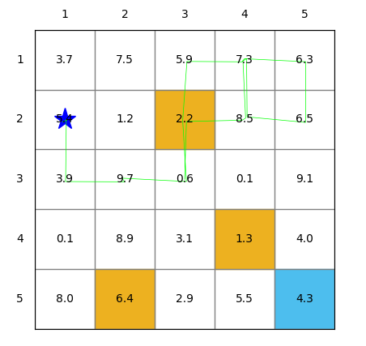

# Quick Start

This is the code implementation of *[Mathematical Foundations of Reinforcement Learning](https://github.com/MathFoundationRL/Book-Mathematical-Foundation-of-Reinforcement-Learning)*, instructed by Shiyu Zhao at Westlake University. We provide both the python and matlab implementations. 

## Python Version

### Installation

We support Python 3.7, 3.8, 3.9,  3.10 and 3.11. Make sure the following packages are installed: `numpy` and `matplotlib`.

### How to Run

To run the example, follow the procedures:

Ensure the following packages are installed: `numpy` and `matplotlib`

Design your grid world environment in `examples/arguments.py`. For example, to specify the target state, modify the default value in the following sentence:

```python
parser.add_argument("--target-state", type=Union[list, tuple, np.ndarray], default=(4,4))
```

Change directory to the file `examples/`

```bash
cd examples
```

Run the script:

```bash
python example_grid_world.py
```

You will see a similar animation as shown below:


### Change Argument 

**Open examples/arguments.py, and you can change arguments:**

"env-size" denotes the the number of columns and rows of the grid world. 

The coordinate system for all the states in the environment, e.g., start-state, target-state and forbidden-states, here aligns with the conventional setup in Python, where `(0, 0)` is typically used as the origin of coordinates.

If you want to save figures in each step, please modify the "debug" argument to  "True":

```bash
parser.add_argument("--debug", type=bool, default=True)
```


### API Interface

The grid world environments as simple Python `env` classes. Creating the grid world environment instances and interacting with them is very simple:

```python
from src.grid_world import GridWorld

 	env = GridWorld()
    state = env.reset()               
    for t in range(20):
        env.render()
        action = np.random.choice(env.action_space)
        next_state, reward, done, info = env.step(action)
        print(f"Step: {t}, Action: {action}, Next state: {next_state+(np.array([1,1]))}, Reward: {reward}, Done: {done}")

```


The policy is constructed as a matrix form, which can be designed to be deterministic or stochastic:

 ```python
     policy_matrix=np.random.rand(env.num_states,len(env.action_space))                                       
     policy_matrix /= policy_matrix.sum(axis=1)[:, np.newaxis] 
 ```

Moreover, If the length of the arrow is too large, you can open src/grid_world.py, and change the magnitude of the length:

 ```python
self.ax.add_patch(patches.FancyArrow(x, y, dx=(0.1+action_probability/2)*dx, dy=(0.1+action_probability/2)*dy, color=self.color_policy, width=0.001, head_width=0.05))   
 ```


 To add state values:

```python
values = np.random.uniform(0,10,(env.num_states,))
env.add_state_values(values)
```



To render the environment:

```python
env.render(animation_interval=3)    # the figure will stop for 3 seconds
```


## Matlab Version

### Requirements

- Matlab >= R2020a, in order to implement the function *exportgraphics()*.

### How to Run

Please start the m-file "main.m". 

Four figures will be illustrated: 

The first figure is to show the policy: The length of arrow is related to the probability of choosing this action, and the circle represents the agent stays in the current state.


The second and the third figures are used to draw the trajectory in two different manner: 


The fourth figure is used to show the state value for each state. 


### API interface

The main algorithm:

```matlab
for step = 1:episode_length
    action = stochastic_policy(state_history(step, :), action_space, policy, x_length, y_length);   
    % Calculate the new state and reward
    [new_state, reward] = next_state_and_reward(state_history(step, :), action, x_length, y_length, final_state, obstacle_state, reward_forbidden, reward_target, reward_step);
    % Update state and reward history
    state_history(step+1, :) = new_state;
    reward_history(step) = reward;
end
```

The stochastic policy is shown as:

```matlab
function action = stochastic_policy(state, action_space, policy, x_length, y_length)
    % Extract the action space and policy for a specific state
    state_1d = x_length * (state(2)-1) + state(1); 
    actions = action_space{state_1d};
    policy_i = policy(state_1d, :);

    % Ensure the sum of policy probabilities is 1
    assert(sum(policy_i) == 1, 'The sum of policy probabilities must be 1.');
    
    % Generate a random index based on policy probabilities
    action_index = randsrc(1, 1, [1:length(actions); policy_i]);
    
    % Select an action
    action = actions{action_index};
end
```

The state transition function:

```matlab
function [new_state, reward] = next_state_and_reward(state, action, x_length, y_length, target_state, obstacle_state, reward_forbidden, reward_target, reward_step)
    new_x = state(1) + action(1);
    new_y = state(2) + action(2);
    new_state = [new_x, new_y];

    % Check if the new state is out of bounds
    if new_x < 1 || new_x > x_length || new_y < 1 || new_y > y_length
        new_state = state;
        reward = reward_forbidden;
    elseif ismember(new_state, obstacle_state, 'rows')
        % If the new state is an obstacle
        reward = reward_forbidden;
    elseif isequal(new_state, target_state)
        % If the new state is the target state
        reward = reward_target;
    else
         % If the new state is a normal cell
        reward = reward_step;
    end
end
```

## About the Authors

The instructor's homepage https://www.shiyuzhao.net/ (Google Site) and the research group website [https://shiyuzhao.westlake.edu.cn](https://shiyuzhao.westlake.edu.cn/).

Both the python and MATLAB code for the grid environment is provided and maintained by Yize Mi miyize@westlake.edu.cn. The original version of the python code is provided by Jianan Li (lijianan@westlake.edu.cn) (has graduated). 

